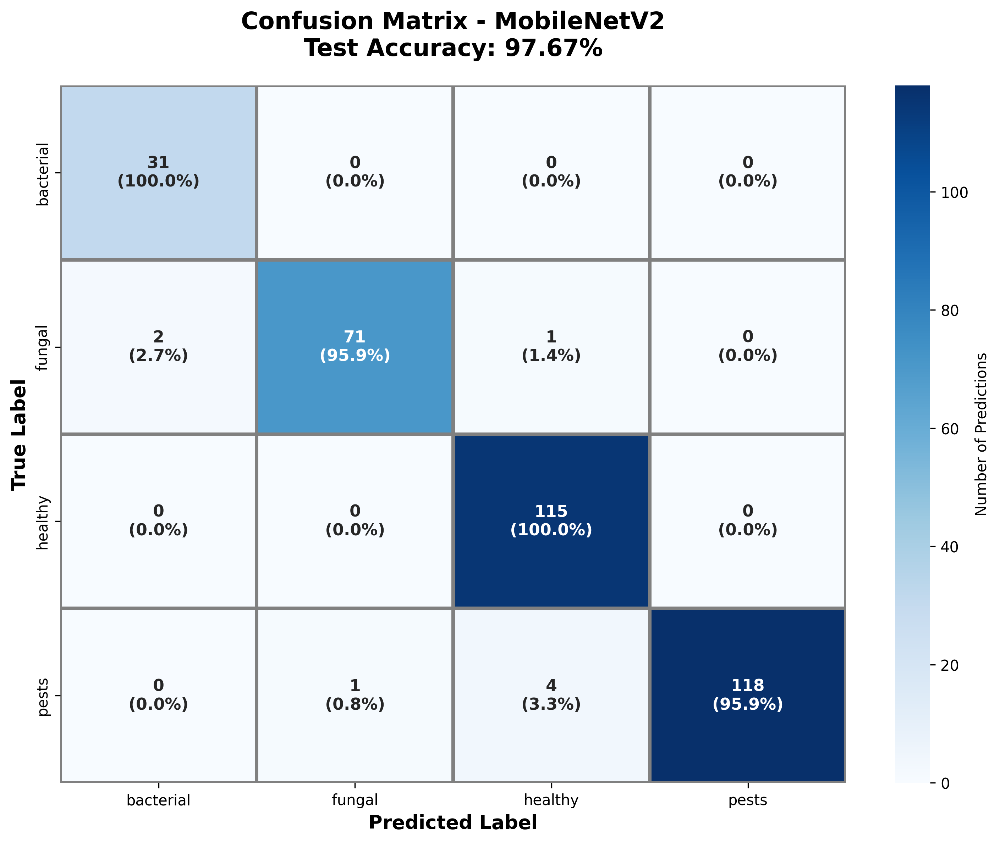

# 🌿 Tulsi Leaf Plant Disease Detection

A high-accuracy deep learning model for detecting diseases in Tulsi (Holy Basil) leaves using computer vision and transfer learning.

[](.)
[](.)
[](.)
[](.)

## 🎯 Overview

This project implements a state-of-the-art machine learning model that can automatically identify and classify diseases in Tulsi plant leaves into 4 categories:

- 🦠 **Bacterial** infections
- 🍄 **Fungal** infections  
- 🐛 **Pest** infestations
- ✅ **Healthy** leaves

The model achieves **97.67% accuracy** on the test set and provides treatment recommendations for detected diseases.

## ⚡ Quick Start

### Installation

```bash
# Install dependencies
pip install tensorflow numpy pillow

# Or use the full requirements
pip install -r requirements_full.txt
```

### Basic Usage

```python
from detector import TulsiDiseaseDetector

# Load the model
detector = TulsiDiseaseDetector(
    'tulsi_disease_detection_best_model.h5',
    'model_config.json'
)

# Make a prediction
result = detector.predict('path/to/leaf_image.jpg')

print(f"Disease: {result['predicted_disease']}")
print(f"Confidence: {result['confidence_percentage']}")

# Get treatment advice
treatment = detector.get_treatment_recommendation(result)
print(treatment)
```

### Run Demo

```bash
python3 demo_prediction.py
```

## 📊 Model Performance

| Metric | Score |
|--------|-------|
| **Test Accuracy** | **97.67%** |
| Test Precision | 97.76% |
| Test Recall | 97.67% |
| Test F1-Score | 97.67% |

### Per-Class Performance

| Disease | Precision | Recall | F1-Score |
|---------|-----------|--------|----------|
| **Bacterial** | 93.94% | 100.00% | 96.88% |
| **Fungal** | 98.61% | 95.95% | 97.26% |
| **Healthy** | 95.83% | 100.00% | 97.87% |
| **Pests** | 100.00% | 95.93% | 97.93% |

## 📁 Project Structure

```
.
├── tulsi_disease_detection_best_model.h5  # Trained model (14MB)
├── model_config.json                      # Model configuration
├── detector.py                            # Prediction wrapper
├── api.py                                 # FastAPI server
├── train_model.py                         # Full training pipeline
├── train_quick.py                         # Quick training script
├── demo_prediction.py                     # Demo script
├── test_system.py                         # System verification
├── requirements_full.txt                  # Dependencies
├── PROJECT_SUMMARY.md                     # Complete documentation
├── QUICK_START.md                         # Quick reference
└── visualization_*.png                    # Performance visualizations
```

## 🔬 Technical Details

### Model Architecture

- **Base Model**: MobileNetV2 (ImageNet pre-trained)
- **Input Size**: 224×224×3 RGB images
- **Total Parameters**: 2,620,356
- **Transfer Learning**: Frozen base + custom classification head

### Training Configuration

- **Dataset**: 2,274 images across 4 classes
- **Split**: 70% train, 15% validation, 15% test
- **Augmentation**: Rotation, flip, zoom, brightness, shift
- **Optimizer**: Adam (lr=0.0001)
- **Loss**: Categorical crossentropy with class weights
- **Callbacks**: Early stopping, learning rate reduction

### Data Distribution

| Class | Images | Percentage |
|-------|--------|------------|
| Bacterial | 204 | 9.0% |
| Fungal | 490 | 21.5% |
| Healthy | 765 | 33.6% |
| Pests | 815 | 35.8% |

## 📊 Visualizations

The project includes comprehensive visualizations:

1. **Class Distribution** - Dataset composition
2. **Data Split** - Train/val/test distribution
3. **Confusion Matrix** - Model predictions vs ground truth
4. **Per-Class Performance** - Metrics by disease type
5. **Model Summary** - Complete performance card



## 🚀 API Deployment

Start the FastAPI server:

```bash
python3 api.py
```

Make predictions via HTTP:

```bash
curl -X POST "http://localhost:8000/predict" \
  -F "file=@test_image.jpg" \
  -F "model_name=mobilenet"
```

Access the API documentation at `http://localhost:8000/docs`

## 💊 Treatment Recommendations

The system provides specific treatment advice for each disease:

### Bacterial Infections
- Apply copper-based bactericide
- Improve air circulation
- Avoid overhead watering
- Remove infected leaves
- Sterilize tools

### Fungal Infections
- Apply organic fungicide (neem oil)
- Reduce humidity
- Ensure drainage
- Remove affected parts
- Regular monitoring

### Pest Infestations
- Apply neem oil spray
- Use insecticidal soap
- Install sticky traps
- Check regularly
- Introduce beneficial insects

## 🔄 Retraining the Model

### Quick Training (15 epochs, ~10 minutes)

```bash
python3 train_quick.py
```

### Full Training (50 epochs, multiple models)

```bash
python3 train_model.py
```

## 📈 Key Features

✅ **High Accuracy** - 97.67% test accuracy  
✅ **Balanced Performance** - All classes >95% F1-score  
✅ **Class Imbalance Handling** - Weighted loss function  
✅ **Robust Augmentation** - Comprehensive data augmentation  
✅ **Transfer Learning** - Leverages ImageNet knowledge  
✅ **Lightweight** - Only 14MB model size  
✅ **Treatment Advice** - Actionable recommendations  
✅ **Production Ready** - FastAPI deployment included  
✅ **Well Documented** - Complete guides and examples

## 🧪 System Testing

Verify the installation:

```bash
python3 test_system.py
```

## 📚 Documentation

- **[PROJECT_SUMMARY.md](PROJECT_SUMMARY.md)** - Complete project documentation
- **[QUICK_START.md](QUICK_START.md)** - Quick reference guide
- **[model_evaluation_results.csv](model_evaluation_results.csv)** - Detailed metrics

## 🔧 Requirements

- Python 3.7+
- TensorFlow 2.x
- NumPy
- Pillow
- FastAPI (for API deployment)
- Other dependencies in `requirements_full.txt`

## 💡 Example Output

```python
{
  'predicted_disease': 'bacterial',
  'confidence': 0.995,
  'confidence_percentage': '99.5%',
  'all_class_probabilities': {
    'bacterial': 0.995,
    'fungal': 0.004,
    'healthy': 0.000,
    'pests': 0.001
  },
  'is_healthy': False,
  'needs_treatment': True
}
```

## 🎓 Learning Resources

This project demonstrates:
- Transfer learning with pre-trained models
- Image classification with CNNs
- Handling imbalanced datasets
- Data augmentation techniques
- Model evaluation and visualization
- API deployment with FastAPI
- Production-ready ML systems

## 🤝 Contributing

This is an educational project. Feel free to:
- Add more disease classes
- Improve model architecture
- Enhance visualizations
- Add multilingual support
- Implement mobile deployment

## 📝 Citation

If you use this project, please cite:

```
Tulsi Leaf Plant Disease Detection using MobileNetV2
Transfer Learning Approach for Agricultural AI
2025
```

## 📄 License

This project is for educational and research purposes.

## 🙏 Acknowledgments

- Dataset collected and labeled for Tulsi disease classification
- MobileNetV2 architecture from TensorFlow/Keras
- Transfer learning techniques from ImageNet

---

**Built with ❤️ for sustainable agriculture and plant health**

🌿 Protecting Tulsi plants, one prediction at a time!